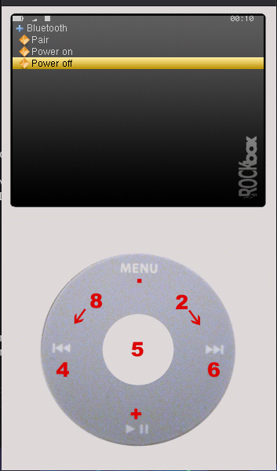
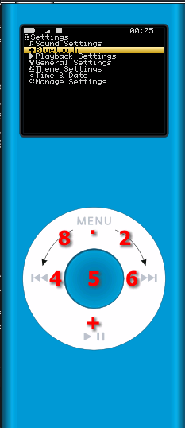
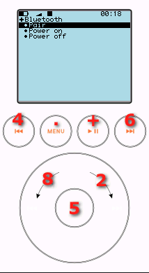

# Rockbox with Bluetooth support.

               __________               __   ___.     *
     Open      \______   \ ____   ____ |  | _\_ |__   _______  ___
     Source     |       _//  _ \_/ ___\|  |/ /| __ \ /  _ \  \/  /
     Jukebox    |    |   (  <_> )  \___|    < | \_\ (  <_> > <  <
     Firmware   |____|_  /\____/ \___  >__|_ \|___  /\____/__/\_ \
                       \/            \/     \/    \/            \/
	 *with Bluetooth

Pair Rockbox with [a microcontroller running this firmware](https://github.com/loafbrad/ipod_bluetooth_arduino) to control your Bluetooth module through software!

## Supported iPods

- [ ] ~~iPod 1g/2g~~ (not currently attempting/supporting)
- [ ] ~~iPod 3g~~ (See comment below*)
- [x] iPod 4g "Photo/Color" (via 30-pin serial)
- [x] iPod 5g "Video"
- [x] iPod 6g/7g "Classic"
- [x] iPod mini 1st/2nd (via 30-pin serial)
- [x] iPod nano 1st/2nd

*iPod 3g **does** expose a serial port through the headphone accessory port with RX/TX. However **current Rockbox build does not support this**. TBD on when this will be available.

Build Your Own Rockbox

1. Clone 'rockbox' from git (or extract a downloaded archive).

   $ git clone git://git.rockbox.org/rockbox

     or

   $ tar xJf rockbox.tar.xz

2. Create a build directory, preferably in the same directory as the firmware/
   and apps/ directories. This is where all generated files will be written.

   $ cd rockbox
   $ mkdir build
   $ cd build

3. Make sure you have mips/m68k/arm-elf-gcc and siblings in the PATH. Make sure
   that you have 'perl' in your PATH too. Your gcc cross compiler needs to be
   a particular version depending on what player you are compiling for. These
   can be generated using the rockboxdev.sh script in the /tools/ folder of the
   source.

   $ which arm-elf-eabi-gcc
   $ which perl

4. In your build directory, run the 'tools/configure' script and enter what
   target you want to build for and if you want a debug version or not (and a
   few more questions). It'll prompt you. The debug version is for making a
   gdb version out of it. It is only useful if you run gdb towards your target
   Archos.

   $ ../tools/configure

5. *ploink*. Now you have got a Makefile generated for you.

6. Run 'make' and soon the necessary pieces from the firmware and the apps
   directories have been compiled, linked and scrambled for you.

   $ make
   $ make zip

7. unzip the rockbox.zip on your music player, reboot it and
   *smile*.

If you want to build for more than one target, just create several build
directories and create a setup for each target:

   $ mkdir build-fuzeplus
   $ cd build-fuzeplus
   $ ../tools/configure

   $ mkdir build-xduoox3
   $ cd build-xduoox3
   $ ../tools/configure

Questions anyone? Ask on the mailing list or on IRC. We'll be happy to help you!
